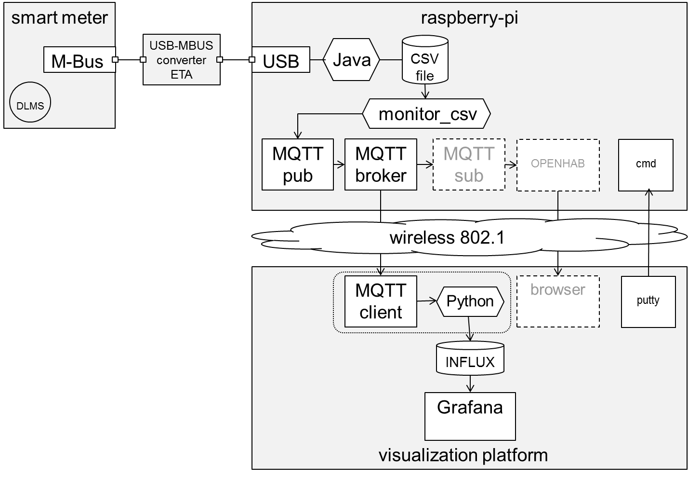
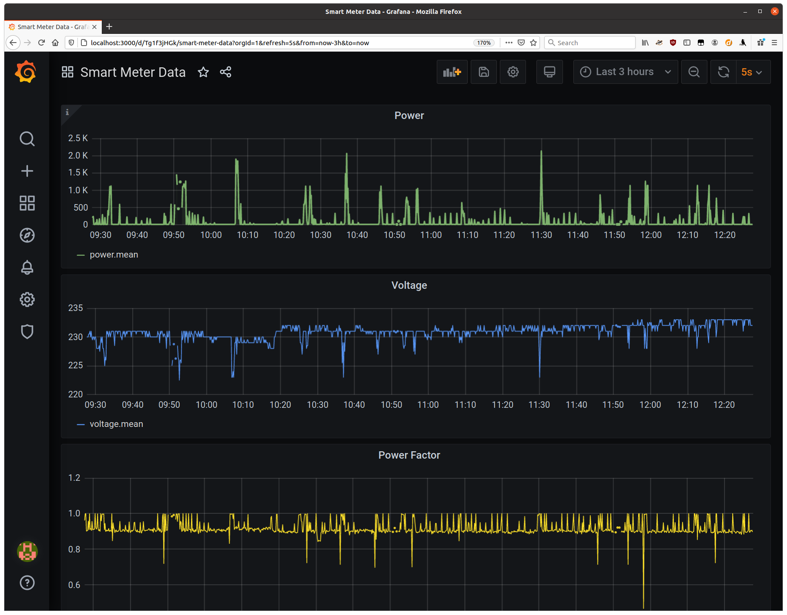

# CII Read Your Smart Meter
Read your own smart meter and visualize your electricity consumption.
Create dashboards with valuable information and share it!

# Goal

Read your Smart Meter through the local Customer Information Interface (CII)
and visualize your consumption.
Design a dashboard with the most useful information.

# Idea

Two Smart Meters ([Landis+Gyr E450](https://www.landisgyr.ch/product/landisgyr-e450/))
will be installed on-site and will be measuring the consumption of different devices.
The live consumption is to be displayed on a web-based dashboard.
Ideally, live measurements are to be combined with historical data.
At the end, the dashboard will be able to display the most important information to an individual about their electricity consumption.
.

# Why

In Switzerland, it is prescribed by law that all electricity Smart Meters
installed by utilities must have a local interface (CII),
so that customers can have access to their own data.
Transparency is increased as individuals can manage their own data.
Innovation is promoted, as precise data is available for free in real time.

# Data

Live measurements from Smart Meters Historical data of an EKZ test site

# Architecture Diagram


# Setup Procedure
The setup basically follows the approach outlined in two
DIY IoT blog posts ([Connect Raspberry Pi to MQTT](https://diyi0t.com/microcontroller-to-raspberry-pi-wifi-mqtt-communication/)
and
[Display using InfluxDB and Grafana](https://diyi0t.com/visualize-mqtt-data-with-influxdb-and-grafana/))

## Raspberry Pi
Connecting to the Raspberry Pi requires knowing its IP address.
This was provided access the existing Team-Viewer installation. 
Access to a **bash** session on the Pi can then be obtained
with **ssh** or [Putty](https://putty.org/).
For example:

```
ssh pi@172.28.255.239
```

### Mosquitto
**MQTT broker and client software.**

Install the [MQTT](https://en.wikipedia.org/wiki/MQTT) (Message Queuing Telemetry Transport)
broker and client on the Raspberry Pi:

```
sudo apt-get install mosquito mosquito-clients
```

### MQTT publish 
**Bash script file change notification tool.**

Rather than write a program that would replace the proprietary jar file,
a simpler bash script approach was used.
This requires a way to trigger commands when the 
contents of the CSV file being written by the proprietary jar file changes.
Although there are many solutions, the **inotify** approach was used.

```
sudo apt-get install inotify-tools
```
Then run the bash script [monitor_csv](monitor_csv) on the Raspberry Pi:

```
./monitor_csv
```

## Client Computer
### InfluxDB
**Time series database.**

The smart meter measurement events are stored in an InfluxDB database.

```
sudo apt-get install influxdb influxdb-client
```

Run the [MQTTInfluxDBBridge.py](MQTTInfluxDBBridge.py)
python script to start moving the MQTT messages into the InfluxDB:

```
python3 MQTTInfluxDBBridge.py
```

After a few messages are processed,
the database can be exercised with the influx command line tool:

```
$ influx
> use smartmeter
> show measurements
name: measurements
name
----
pf
power
voltage
> select * from voltage;
name: voltage
time                timestamp           voltage
----                ---------           -------
1598634419180514187 28.08.2020 19:06:59 229
1598634424287928040 28.08.2020 19:07:04 231
...
> select * from pf;
name: pf
time                pf    timestamp
----                --    ---------
1598634419180514187 0.912 28.08.2020 19:06:59
1598634424287928040 0.91  28.08.2020 19:07:04
...
> select * from power;
name: power
time                power timestamp
----                ----- ---------
1598634419180514187 10    28.08.2020 19:06:59
1598634424287928040 11    28.08.2020 19:07:04
...
```

### Grafana
**Time series visualization software.**

Follow the [instructions](https://grafana.com/grafana/download):

```
sudo apt-get install -y adduser libfontconfig1
wget https://dl.grafana.com/oss/release/grafana_7.1.5_amd64.deb
sudo dpkg -i grafana_7.1.5_amd64.deb
sudo service grafana-server start
```

Then browse to [Grafana](http://localhost:3000/)
and login (username: **admin**, password: **admin**).
The Explorer tab lets you make ad-hoc queries,
and the Dashboards tab lets you create a dashboard using a nice GUI.

# UI

